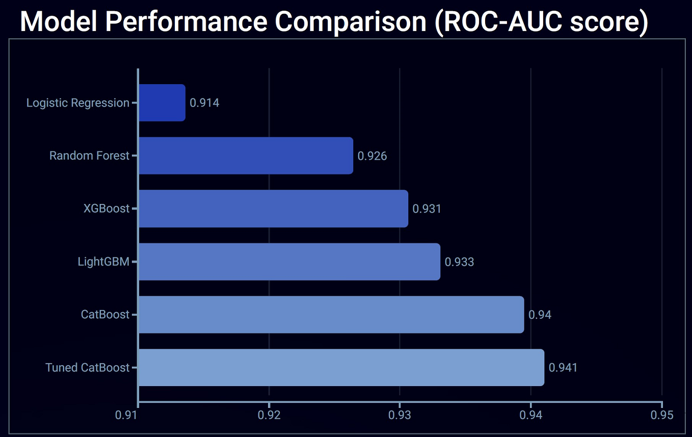
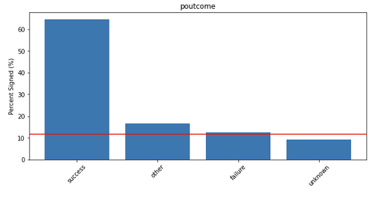
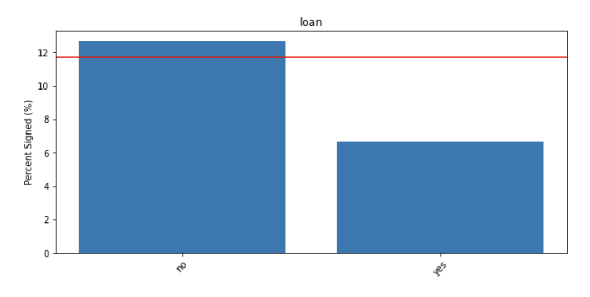

# Bank Marketing Campaign Analysis

**Author**: [Matt LeRoi](mailto:mcleroi@gmail.com) 

# Overview

The banking industry runs on trust - a customer's faith that the money they are giving to the bank will be held safely and that the bank's promises will be kept. The acquisition cost of a customer can be high, but once a relationship is established it can be lasting and valuable. 

# Business Understanding

A Portuguese banking institution recorded data (published [here](https://www.kaggle.com/datasets/adityamhaske/bank-marketing-dataset)) about the potential customers targeted for a phone marketing outreach campaign. This involved one or a series of calls. A more detailed understanding of the results of these campaigns could show which customers are more likely to sign, or show which details about the interactions are most likely to lead to customers signing.

# Data

The bank provided data on ~45,000 customers, including background information on the client (such as age, job, marital status, etc.) and details about their interactions (such as how frequently and how long ago they were contacted). About 12% of the customers signed.

# Modeling

Several baseline models were created for this project (LogisticRegression, DecisionTreeClassifier, XGBClassifier, LGBMClassifier, and CatBoostClassifier), and one was selected for further tuning. These were all used as binary classifiers to predict whether a customer would sign or not. 75% of the data was used for training, 10% as a validation set to evaluate and tune the models, and 15% as a final test set for the final tuned model.

# Evaluation

The bank would like to know which customers to give special attention to, but also doesn't want to waste its energy on customers unlikely to sign. The Area Under the Curve of the Receiver Operating Characteristic curve (ROC-AUC) is a metric that takes into account both the true positive and false positive rates, and will be used for evaluation and comparison between models. A general sense of how to interpret the result is [published here](https://www.deepchecks.com/question/what-is-a-good-roc-curve-score/#:~:text=How%20to%20interpret%20AUC%20score,Discrimination%20of%200.7%2D0.8%20=%20Acceptable) and reproduced below:

1.0: Perfect classifier  
0.9-1.0: Excellent discrimination  
0.7-0.9: Acceptable discrimination  
0.5-0.7: Poor to inadequate discrimination  
0.5: No discrimination; the model is no better than random chance  

# Conclusion

The baseline models each performed well, with the CatBoost Classifier performing the best. It was then tuned and improved further, with the results shown below: 

The most significant contributors to the model were found to be:
1. Call duration (longer calls were more likely to sign)
2. Previous outcome success (a previously successful outcome was more likely to lead to another successful outcome)
3. Whether the customer had a housing loan (having a housing loan was negatively associated with a customer signing)
4. Contact type (unknown contact types were less likely to sign)
5. Number of contacts during per campaign (more contacts were more likely to sign)

These charts show that a previously successful outcome was more likely to lead to another successful outcome and that having a housing loan was negatively associated with a customer signing.

## Limitations

The available data is from Portuguese customers and cultural differences to the US or other countries may mean that the learnings here may not transfer perfectly. Also, a few columns like previous outcome and contact type have a high number of unknown entries, but still contribute significantly to the model. Finally, the model identifies correlations, which do not necessarily imply a causal relationship. 

## Recommendations

1. Collect more detailed data - filling in all of the missing data may lead to further insights.
2. Run a controlled experiment - design an experiment to determine whether call duration and number of contacts are causal or correlative relationships.
3. The data varied by month, both in volume and in the success rate. This may indicate seasonality or it may have been due to the timing of the marketing campaign, which I do not have access to. It is worth further investigation.

## For More Information

See the full analysis in the [Jupyter Notebook](https://github.com/MattLeRoi/modeling_banking_customers/blob/722afea03697297c749dc68586ffdfb688c3a7dd/index.ipynb) and the [presentation](https://github.com/MattLeRoi/modeling_banking_customers/blob/de0ef8118090d63ecfa5498add450aa5978b6854/slides.pdf).

For additional info, contact Matt LeRoi at [mcleroi@gmail.com](mailto:mcleroi@gmail.com)

* [images](https://github.com/MattLeRoi/modeling_banking_customers/tree/de0ef8118090d63ecfa5498add450aa5978b6854/images)
* [data](https://github.com/MattLeRoi/modeling_banking_customers/tree/de0ef8118090d63ecfa5498add450aa5978b6854/data)
* [.gitignore](https://github.com/MattLeRoi/modeling_banking_customers/blob/de0ef8118090d63ecfa5498add450aa5978b6854/.gitignore)
* [README.md](https://github.com/MattLeRoi/modeling_banking_customers/blob/de0ef8118090d63ecfa5498add450aa5978b6854/README.md)
* [index.ipynb](https://github.com/MattLeRoi/modeling_banking_customers/blob/de0ef8118090d63ecfa5498add450aa5978b6854/index.ipynb)
* [slides.pdf](https://github.com/MattLeRoi/modeling_banking_customers/blob/de0ef8118090d63ecfa5498add450aa5978b6854/slides.pdf)