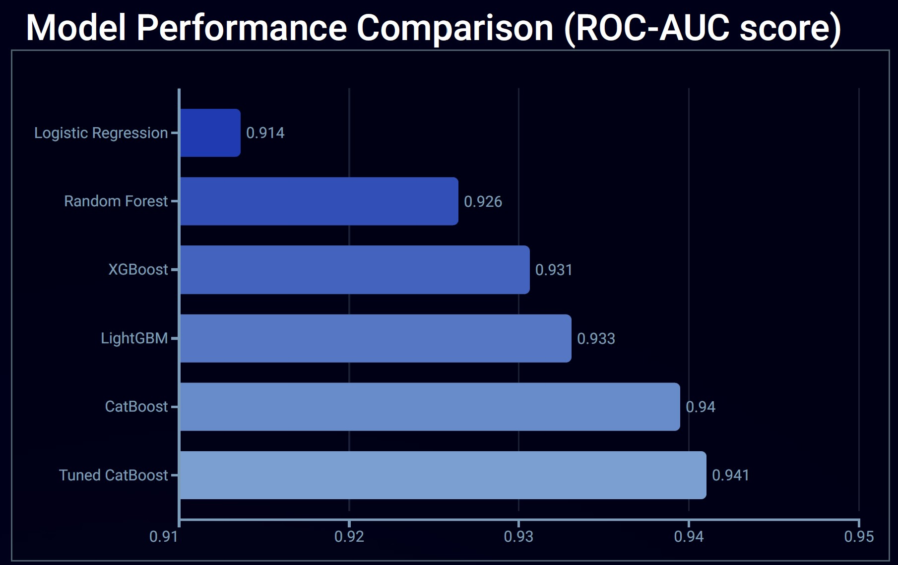

# Bank Marketing Campaign Analysis

**Author**: [Matt LeRoi](mailto:mcleroi@gmail.com) 

# Overview

The banking industry runs on trust - a customer's faith that the money they are giving to the bank will be held safely and that the bank's promises will be kept. The acquisition cost of a customer can be high, but once a relationship is established it can be lasting and valuable. 

# Business Understanding

A Portuguese banking institution recorded data about the potential customers targeted for a phone marketing outreach campaign. This involved one or a series of calls. A more detailed understanding of the results of these campaigns could show which customers are more likely to sign, or show which details about the interactions are most likely to lead to customers signing.

# Data

The bank provided data on ~45,000 customers, including background information on the client (such as age, job, marital status, etc.) and details about their interactions (such as how frequently and how long ago they were contacted). About 12% of the customers signed.

# Modeling

Several baseline models were created for this project (LogisticRegression, DecisionTreeClassifier, XGBClassifier, LGBMClassifier, and CatBoostClassifier), and one was selected for further tuning. These were all used as binary classifiers to predict whether a customer would sign or not. 75% of the data was used for training, 10% as a validation set to evaluate and tune the models, and 15% as a final test set for the final tuned model.

# Evaluation

The bank would like to know which customers to give special attention to, but also does't want to waste its energy on customers unlikely to sign. The Area Under the Curve of the Receiver Operating Characteristic curve (ROC-AUC) is a metric that takes into account both the true positive and false positive rates, and will be used for evaluation and comparison between models. 

\(1.0\): Perfect classifier. \(0.5\): No discrimination; the model is no better than random chance.  \(0.5-0.7\): Poor to inadequate discrimination.  \(0.7-0.8\): Acceptable discrimination.  \(0.8-0.9\): Good discrimination.  \(0.9-1.0\): Excellent discrimination. 

The goal of this project is financial, to increase profits for SyriaTel. The recall and precision scores are relevant, as we are trying to identify as many of the churning customers as possible (recall rate) while limiting the number of customers we reach out to unnecessarily (precision rate). To combine these two scores, I have taken the estimate provided by SyraiTel to directly calculate the actual financial impact to the company. Each correctly identified churning customer (True Positive, TP) is worth $80 on average, and every person SyriaTel reaches out to (True Positive plus False Positive, TP+FP) costs $20. The final evaluation criterion is then: $80TP + $20*(TP+FP), which is the total profit (or loss) of the experiment.


# Conclusion

The final logistic regression model achieved a profit of $1300, correctly identifying 35 out of 101 churning customers, with 40 falsely identified churning customers. This is a positive result, literally, with a positive dollar value associated with it, but identifying roughly a third of the churning customers is not nearly as accurate as I would like.

The final hypertuned decision tree classifier model outperformed the logistic regression model, achieving a profit of $4180 after hypertuning, correctly identifying 75 out of 101 churning customers, with 16 falsely identified churning customers. 



## Limitations

The available data covers a small number of customers in one geographical area and only includes basic usage and account data. It appears that there is enough to be useful, but more detailed data could be extremely helpful to refine the model further. Also, the financial evaluation is based on rough estimates, so further experimentation can refine the evaluation criteria.

## Recommendations

The model provided should yield positive results. Broader data, however, covering more of SyriaTel’s customers and containing more varied and detailed information, should help refine the model. Also, a few insights from how the classification tree was built:

Customers with high usage and no voice mail plan churned at a very high rate, ~90%. I recommend looking into this group further. Is this line only used for a specific purpose and then closed? These could be high value customers since their usage is high, so the rewards for solving their high churn rate could be great.

Customers with low usage and high customer service calls churned at a high rate, unsurprisingly. Looking for patterns in customer service calls may lead to better customer engagement with more usage and greater retention.

Finally, customers with low usage, few customer service calls, and no international plan stayed at a relatively high rate. Generally speaking, customers with higher usage churned at a higher rate in several points in the tree. It may be worth looking into pricing strategies that reward greater use rather than a flat per-minute rate. This could help retain the high value customers and prompt other customers to use the service more.


## For More Information

See the full analysis in the [Jupyter Notebook](./notebook.ipynb).

For additional info, contact Matt LeRoi at [mcleroi@gmail.com](mailto:mcleroi@gmail.com)

```
├── images
├── data
├── README.md
└── noteboook.ipynb
``` 